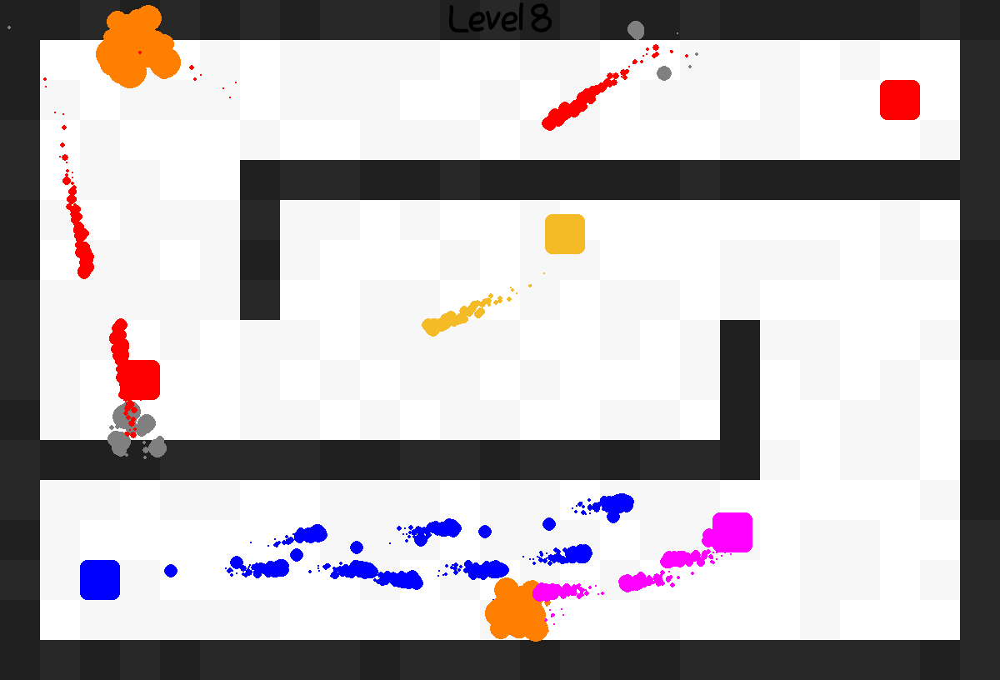

# Tank Game

A doggy-doo-doo tank game made with Python. You are the blue tank. Kill all the enemy tanks. There are 10 levels and 6 types of tanks. I don't know what I am doing :)



## Instructions

### Installation

Make sure you have Pygame installed.

```bash
pip install pygame # install pygame with pip
```

### How To Play

* W, A, S, and D are used to move around.
* Hold the right mouse button to shoot.

### Things To Note

* Enemy tanks can't kill each other.
* Enemies will pass through each other.
* You can't kill yourself with your own bullets.
* Your bullets and enemy bullets will explode when they collide.
* Enemy bullets pass through each other.
* Bullets can bounce off walls.
